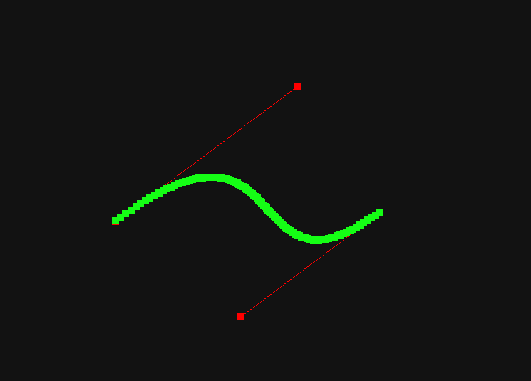

# Bezier Curves in C using SDL



## Overview

This project is an experiment to create and visualize **Bezier Curves** using **C** and the **SDL2** library. The implementation allows rendering smooth curves using a set of control points.

## Features

- Render Bezier curves with handles, just like in tools like Figma, Inkscape, Adobe Illustrator, Figma etc.
- Interactive control points.
- Uses SDL2 for rendering.

## Prerequisites

Ensure you have the following installed before compiling the project:

- **GCC or Clang** (C compiler)
- **SDL2 library**
- **Make** (optional, for using the Makefile)

### Installing SDL2

On Linux (Debian/Ubuntu-based):

```sh
sudo apt update
sudo apt install libsdl2-dev
```

On Windows (MSYS2 MinGW64):

```sh
pacman -S mingw-w64-ucrt-x86_64-SDL2
```

## Building the Project

### Using Makefile

To compile the project and output to the `build/` directory, run:

```sh
make
```

### Manually Compiling

If not using Makefile, compile with:

```sh
gcc -Wall -Wextra -std=c11 -pedantic `pkg-config --cflags --libs sdl2` -o build/bezier main.c
```

## Running the Program

After compiling, run the executable:

```sh
./build/bezier
```

## File Structure

```
bezier-curves/
├── src/
│   ├── main.c        # Main file for rendering Bezier curves
│
├── build/            # Compiled output directory
│   ├── Makefile          # Compilation rules
├── README.md         # Documentation
```

## Bezier Curve Basics

- **Quadratic Bezier Curve**: Uses 3 points (P0, P1, P2)
- **Cubic Bezier Curve**: Uses 4 points (P0, P1, P2, P3)
- Formula:

  ```
  B(t) = (1-t)^2 * P0 + 2(1-t)t * P1 + t^2 * P2  (Quadratic)
  B(t) = (1-t)^3 * P0 + 3(1-t)^2t * P1 + 3(1-t)t^2 * P2 + t^3 * P3 (Cubic)
  ```

- Here, I have implemented Cubic Bezier Curves.

## License

## This project is released under the **MIT License**.

### Author

Anvesh Khode
